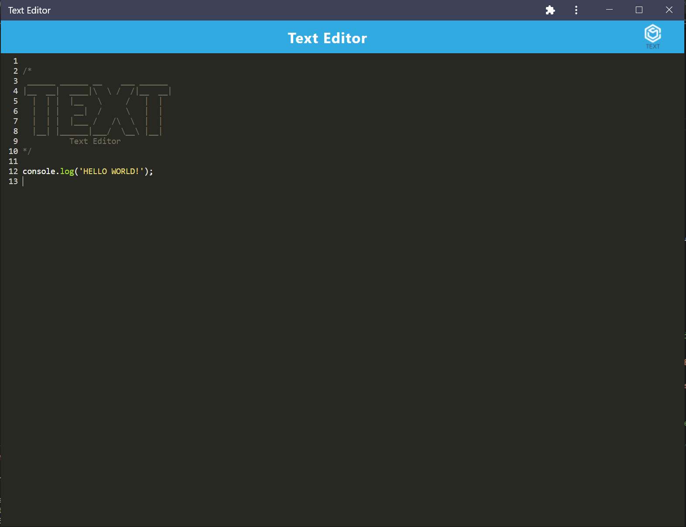

# PWA Text Editor

## Description
PWA Text Editor is an online text editor app that stores the information in the indexedDb database.  You can click the install button to use the app outside of the browser.

## Table of Contents

[Link](#link)

[Media](#media)

[Installation](#installation)

[Usage](#usage)

[License](#license)

[Contributing](#contributing)

[Tests](#tests)

[Questions](#questions)

## Link
[PWA Text Editor](https://text-editor-bh.herokuapp.com/)

## Media
The following image is screen shot of the installed app:

## Installation
To install the necessary dependencies, run the following command:

    npm install

## Usage
Running npm start from the root directory will automatically bundle the files and start the server.  Press the install button to install the app.  Navigate to chrome://apps to open or remove the app once installed.

## License
This product is licensed under MIT

## Contributing
No contributions at this time

## Tests
To run tests, run the following command:

    npm test

## Questions
If you have any questions about the repo, open an issue or contact me directly at <brian.t.halpin@gmail.com>. You can find more
    of my work at [Brian Halpin](https://github.com/bthalpin).
